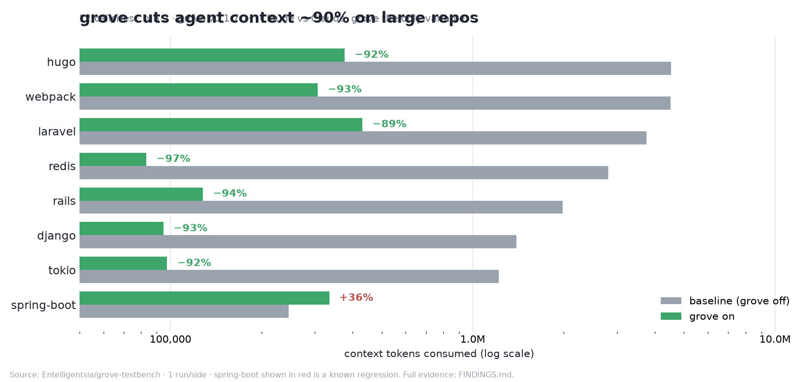

# grove — structural sight for coding agents

grove gives coding agents **structural, byte-precise, token-cheap access to a
codebase** via tree-sitter — instead of reading whole files. One engine, seven
tools, **two faces** (a human CLI `grove <verb>` and an MCP server `grove serve`),
with grammars loaded **at runtime from a WASM registry**, so adding a language
needs no recompile and no toolchain on the consumer.


*(asciinema cast: [`docs/assets/grove_demo.cast`](docs/assets/grove_demo.cast) —
play it interactively with `asciinema play docs/assets/grove_demo.cast`.)*

## Why grove

Agents burn tokens and round-trips `grep`-ing and `read`-ing whole files to
answer "where is this defined / what does it do / who calls it." grove replaces
that with **one symbol at a time, by exact bytes**, behind a stable id the agent
passes between turns.

- **Token-cheap** — `outline` a 1700-line file as a skeleton; `source` one
  symbol's body, not the whole file. A `map` call returns a directory's
  definitions + references in one shot.
- **Byte-precise & stable** — every result carries a `symbol-id`
  (`<lang>:<relpath>#<name>@<line>`, 1-based) you pass forward across turns.
- **One engine, two faces** — the same Rust binary drives the CLI and an MCP
  server, so a human and an agent see the same thing.
- **Runtime grammars** — all 27 official tree-sitter grammars load from a hosted
  WASM registry; new languages are a registry entry, not a recompile.

See [`VISION.md`](VISION.md) for the product vision.

## Quick start

```bash
# 1. install (one line — detects platform, verifies sha256)
curl -fsSL https://raw.githubusercontent.com/Entelligentsia/grove/main/install.sh | sh

# 2. wire it into a project (in the project root)
grove init
```

`grove init` detects the project's languages, auto-fetches their grammars, and
writes `.mcp.json` (the tools exist) + a `CLAUDE.md` steering directive (the
agent reaches for grove instead of grep) + `grove.lock`. That's it — your agent
now has structural sight. Other install channels (Homebrew, npm, cargo, agent
skill) and `--as mcp|skill|both` are in **[Install](docs/install.md)** and
**[Setup](docs/setup.md)**.

> As an **agent skill** (Claude Code, Cursor, Codex, Cline, …):
> `npx skills add Entelligentsia/grove` — the skill self-installs the binary on
> first use if it's missing. See [Setup](docs/setup.md).

## Evaluated on real codebases

The eval is [`Entelligentsia/grove-testbench`](https://github.com/Entelligentsia/grove-testbench):
it runs the **same agent (Claude) on the same prompt** with grove off (`baseline`)
and grove on (`grove`) across 10 large, popular, grammar-backed codebases, and
measures the impact on **context tokens, wall-clock time, turns, and answer
quality** — same agent both sides, grove the only variable. It's evidence-first
(blind-judged answers verified against pinned source), not a highlight reel;
where grove regresses, it's reported and filed as a fix.



**Early numbers — L2 callsites, run 2, grove v0.1.7** (1 run/side; full data in
the testbench's `FINDINGS.md`):

- **Context tokens:** median **−93%** (range −89% to −97% on the winners) —
  e.g. [redis](https://github.com/redis/redis) 2.81M → 83K (**−97%**),
  [rails](https://github.com/rails/rails) 1.98M → 128K (**−94%**),
  [webpack](https://github.com/webpack/webpack) 4.52M → 307K (**−93%**),
  [django](https://github.com/django/django) 1.40M → 95K (**−93%**),
  [tokio](https://github.com/tokio-rs/tokio) 1.22M → 98K (**−92%**),
  [hugo](https://github.com/gohugoio/hugo) 4.52M → 377K (**−92%**),
  [laravel](https://github.com/laravel/framework) 3.76M → 432K (**−89%**).
- **Tool calls:** median **−91%** (range −77% to −96%) — fewer, sharper hops
  instead of grepping and whole-file reads.
- **Wall-clock:** median **−64%** (range −48% to −82%) where comparable.

Honest caveat: grove is **not a universal win yet** — on
[spring-boot](https://github.com/spring-projects/spring-boot) it regressed
(+36% context, slower) for the L2 callsites task; that's tracked in the
testbench's `GROVE-ISSUES.md`. The other two charted repos in the testbench are
[TypeScript](https://github.com/microsoft/TypeScript) and
[bitcoin](https://github.com/bitcoin/bitcoin) (tool calls −96% / −59%; their
baseline context was delegated to subagents so isn't on the token chart). The
full per-repo breakdown, methodology, and raw runs:
[`Entelligentsia/grove-testbench`](https://github.com/Entelligentsia/grove-testbench).

## The tools

| | Command | What it returns |
|---|---|---|
| outline | `grove outline <file>` | a file's definition skeleton (kind · name · parent · signature · id) |
| symbols | `grove symbols <dir> --name <n>` | repo-wide symbol search — `--name` is **exact**, `--name-contains` for substring |
| source | `grove source <id>` | one symbol's full source — no whole-file read |
| check | `grove check <file>` | ERROR / MISSING nodes — post-edit syntax check (exit 1 if any) |
| callers | `grove callers <name> -d <dir>` | call sites of a symbol, each with its enclosing function |
| map | `grove map <dir>` | directory dependency graph: definitions + outgoing references, no bodies |
| definition | `grove definition <name>` / `--at <f:l:c>` | go-to-def, by name or from a usage position |

Add `--json` to any command for the agent-facing shape. Full reference + examples:
**[Tools](docs/tools.md)**.

## Documentation

- **[Install](docs/install.md)** — curl/Homebrew/npm/cargo, build from source, the agent skill
- **[Setup](docs/setup.md)** — `grove init`, `--as mcp|skill|both`, what it writes, offline/dry-run
- **[Languages & grammars](docs/languages.md)** — the WASM registry, `fetch`/`lock`, where grammars live, profiles
- **[Tools](docs/tools.md)** — the seven tools, `--json`, `symbol-id`, examples
- **[MCP server](docs/mcp.md)** — `grove serve`, `.mcp.json`, steering, error model
- **[Roadmap & repo layout](docs/roadmap.md)** — what's not done yet, source map
- **[FAQ](docs/faq.md)** — *Is grove an LSP?* and other positioning questions
- [`VISION.md`](VISION.md) — product vision · [`CHANGELOG.md`](CHANGELOG.md) — releases
- Eval: [`Entelligentsia/grove-testbench`](https://github.com/Entelligentsia/grove-testbench) — same agent, grove off vs on, across 10 large repos
- Registry: [`Entelligentsia/grove-registry`](https://github.com/Entelligentsia/grove-registry) · Homebrew tap: [`Entelligentsia/homebrew-grove`](https://github.com/Entelligentsia/homebrew-grove)

## Status

Pre-1.0. `callers`/`definition` are name-based (no receiver-type resolution); 12
languages ship a minimal profile (core tools only); no incremental reparse yet.
Details and the rest of the roadmap: **[Roadmap](docs/roadmap.md)**.