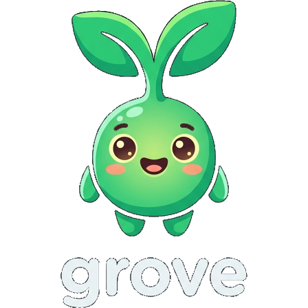
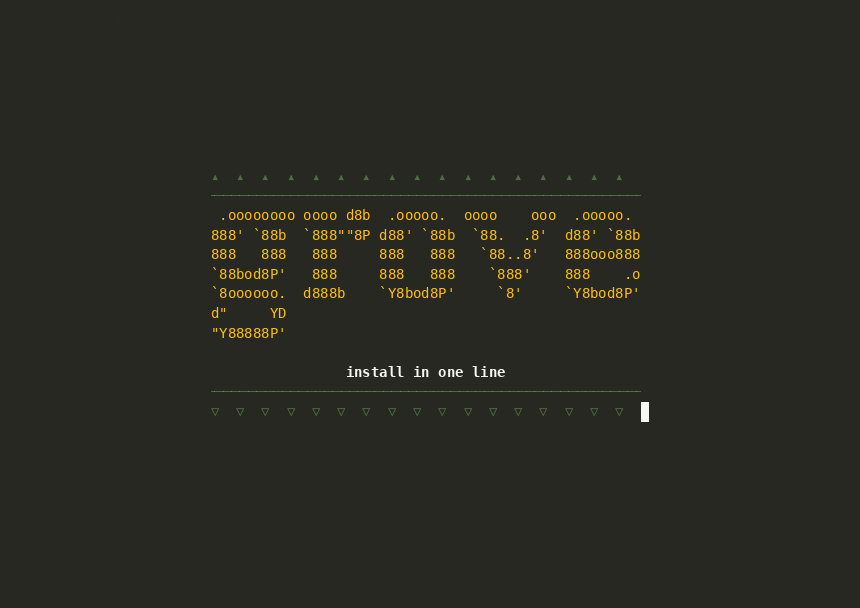
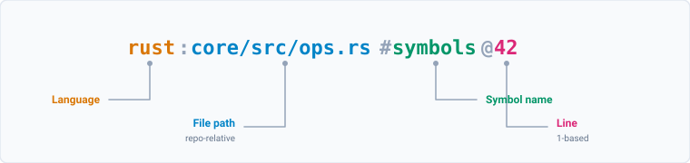
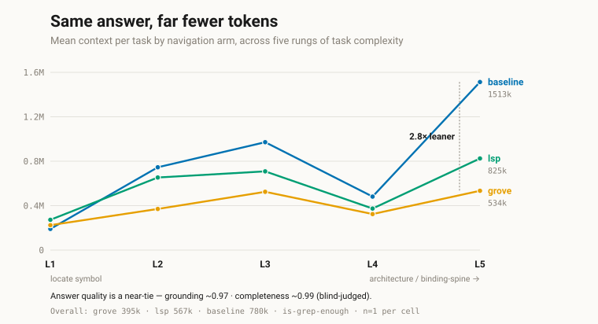
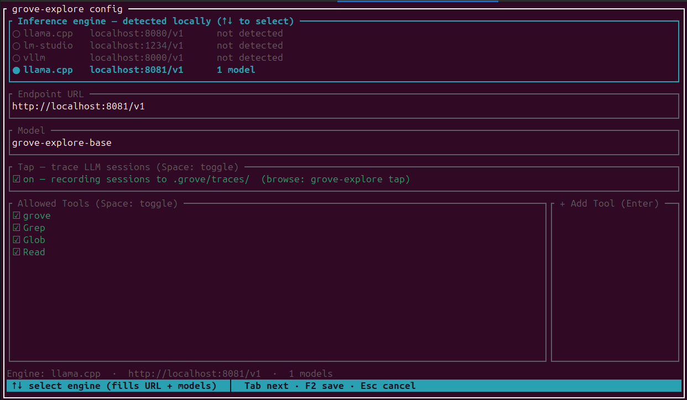
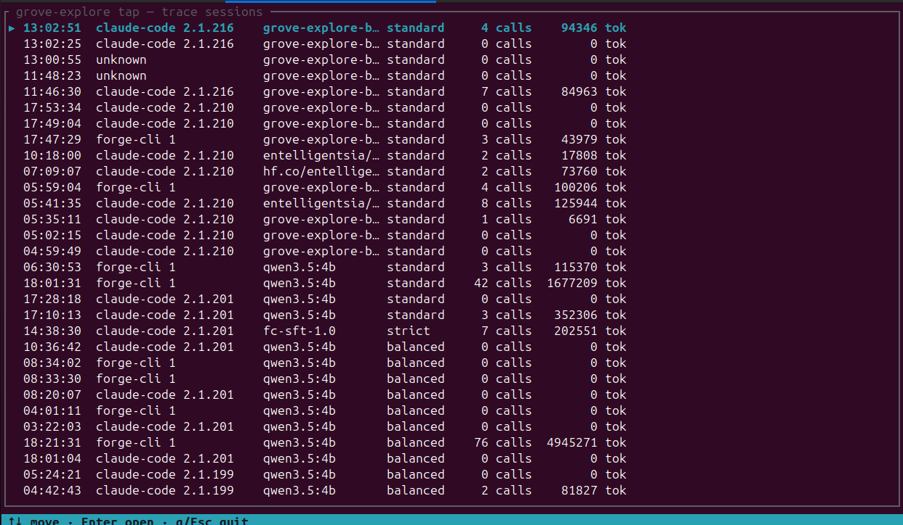
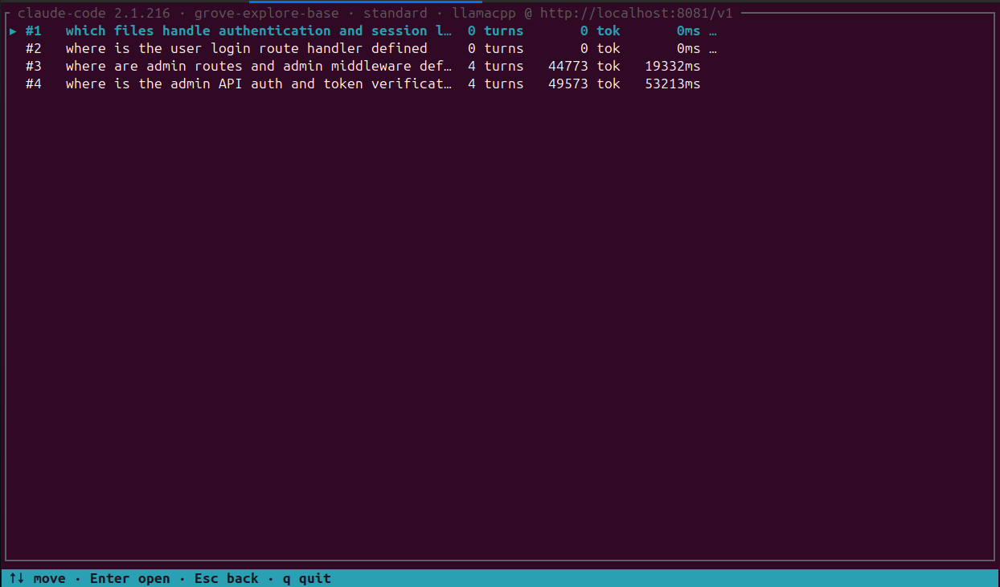
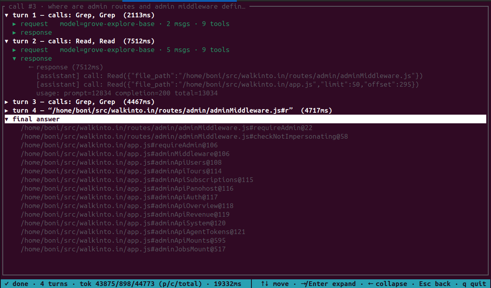
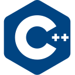

<div align="center">



# grove

### ask where, get exact lines

Two surfaces&nbsp;·&nbsp;one tree-sitter engine&nbsp;·&nbsp;27 languages at runtime

[](https://github.com/Entelligentsia/grove/releases)
[](https://crates.io/crates/grove-cst)
[](https://huggingface.co/entelligentsia/grove-explore-base-GGUF)
[](https://github.com/Entelligentsia/grove/actions)
[](LICENSE)

[Start](#60-second-start)&nbsp;·&nbsp;[The seven tools](#the-seven-tools)&nbsp;·&nbsp;[How it works](#how-it-works)&nbsp;·&nbsp;[Proof](#proof)&nbsp;·&nbsp;[explore](#grove-explore--the-code-locator)&nbsp;·&nbsp;[Model](#the-model--grove-explore-base)&nbsp;·&nbsp;[Docs](#documentation)

<br>



<sub>asciinema cast: [`docs/assets/grove_demo.cast`](docs/assets/grove_demo.cast) — replay with `asciinema play docs/assets/grove_demo.cast`</sub>

</div>

Coding agents burn tokens and round-trips `grep`-ing and reading whole files to
answer *where is this defined, what does it do, who calls it.* grove answers each
with **one symbol, by exact bytes** — behind a stable id the agent reuses across
turns. It's not an LSP; it's the cheap syntactic layer *beneath* one.

Every answer, from either surface, comes back in the same shape:

```
javascript:routes/user.js#isLoggedIn@50
└── grammar  └── path      └── symbol  └── line (1-based)
```

Pass that whole string to `source` to read the symbol's body, or to `callers`
to find its call sites.

## 60-second start

### 1&nbsp;·&nbsp;Install

```bash
curl -fsSL https://raw.githubusercontent.com/Entelligentsia/grove/main/install.sh | sh
```

One line — detects your platform, verifies the sha256, installs **both**
`grove` and `grove-explore`, and honors `HTTP(S)_PROXY`/`ALL_PROXY`/`NO_PROXY`.
Prefer Homebrew, npm, cargo, PowerShell, or building from source? →
**[Install](docs/install.md)**.

### 2&nbsp;·&nbsp;Wire it into your project

```bash
cd your-project
grove init
```

`grove init` detects your languages, fetches their grammars, pins `grove.lock`,
and registers grove with **every coding agent it finds** — Claude Code, Cursor,
Codex, Gemini CLI, Windsurf, VS Code — each at its own config path, plus a
steering note so the agent reaches for grove instead of grep. Scope it with
`--agents claude-code,cursor,…` (or `all`). → **[Setup](docs/setup.md)**.

### 3&nbsp;·&nbsp;Ask your agent

Start a fresh session and ask a *where / what / who-calls* question —
*"where is `provision_project` defined, and who calls it?"* It routes through
grove, not grep. That's it: your agent now has structural sight.

> **Prefer a skill?** `npx skills add Entelligentsia/grove` installs grove as a
> cross-agent skill (Claude Code, Cursor, Codex, Cline, …) and self-installs the
> binary on first use if it's missing.

## The seven tools

| | Command | What it returns |
|---|---|---|
| **outline** | `grove outline <file>` | a file's definition skeleton (kind · name · parent · signature · id) |
| **symbols** | `grove symbols <dir> --name <n>` | repo-wide symbol search — `--name` is **exact**, `--name-contains` for substring |
| **source** | `grove source <id>` | one symbol's full source — no whole-file read |
| **check** | `grove check <file>` | ERROR / MISSING nodes — post-edit syntax check (exit 1 if any) |
| **callers** | `grove callers <name> -d <dir>` | call sites of a symbol, each with its enclosing function |
| **map** | `grove map <dir>` | directory dependency graph: definitions + outgoing references, no bodies |
| **definition** | `grove definition <name>` / `--at <f:l:c>` | go-to-def, by name or from a usage position |

Add `--json` to any command for the agent-facing shape. Full reference +
examples: **[Tools](docs/tools.md)**.

## How it works

Every grove result carries a **symbol-id** — a stable handle the agent passes
from one tool to the next:



`outline` a file to a skeleton of ids → `source` one id for its exact bytes →
`callers` that id for its call sites. **One symbol at a time, by bytes** — never a
whole-file read. Grammars load **at runtime from a hosted WASM registry**, so
adding a language is a registry entry, not a recompile.

- **Token-cheap** — `outline` a 1700-line file as a skeleton; `source` one
  symbol's body, not the file. `map` returns a directory's definitions +
  references in a single call.
- **Byte-precise & stable** — the `symbol-id` above is exact and durable; pass it
  forward across turns instead of re-searching.
- **One engine, two surfaces** — the same Rust core answers the CLI, the
  structural MCP server, and the delegate's inner loop.
- **Runtime grammars** — all 27 official tree-sitter grammars resolve from the
  registry; new languages need no recompile and no toolchain on your machine.

> **Not an LSP.** grove is syntactic, not semantic: it speaks MCP (not LSP),
> parses (doesn't analyze), and locates (doesn't refactor) — no type inference,
> completion, rename, or type-resolved go-to-def. It's complementary to an LSP,
> sitting *beneath* where semantics begin. Full reasoning:
> **[Is grove an LSP?](docs/faq.md)** · Product vision: **[`VISION.md`](VISION.md)**.

## Proof

grove is measured in
**[is-grep-enough](https://github.com/Entelligentsia/is-grep-enough)** — a fair,
blind-judged comparison of three navigation regimes (text `baseline`, structural
`grove`, semantic `lsp`) given the **same agent the same prompt** across **50
tasks**: 10 large, popular, grammar-backed repos × 5 rungs of climbing complexity
(locate a symbol → trace flow → recover an architecture). One variable — the
navigation capability.

[](https://entelligentsia.github.io/is-grep-enough/)

**Same answers, roughly half the context.** grove ties on answer quality
(grounding ~0.97, completeness ~0.99) while running **~2× leaner on tokens** —
widening to **2.8× on the hardest architecture traces** — and reported honestly,
including where it doesn't win.

<details>
<summary>The full curve — three findings, and the methodology</summary>

<br>

- **Answer quality ties — and on the hardest traces grove is the more reliable
  one.** Grounding ~0.97 and completeness ~0.99 across all three arms; grep is
  enough to be *correct* most of the time. But where text search drifts on a
  dense trace — the C++ L5 architecture trace drops baseline grounding to
  **0.80** — grove holds **0.97**, because it cites the real syntax tree instead
  of guessing line numbers.
- **grove runs leaner on context, and the lead widens with complexity.** ~395K
  mean tokens vs 567K (lsp) and 780K (baseline) overall — roughly half the
  text-search context. By the hardest rung (architecture / binding-spine),
  baseline pushes ~1.5M tokens against grove's ~534K — **2.8× leaner** (on the
  TypeScript L5 trace, 2.43M → 570K, **4.3× leaner**) — while grove stays
  tightest on quality.
- **Reported honestly, including where grove doesn't win.** On trivial
  *locate-one-symbol* tasks (L1), grove's fixed structural-call overhead means
  it isn't the cheapest — plain text search is. grove pays off on the navigation
  that actually costs tokens: tracing flow, mapping a subsystem, recovering an
  architecture.

Token throughput isn't the billed bill — much of baseline's volume is cheap
cache reads — but it is what drives context-window pressure and latency. Full
methodology, per-repo data, blind judgements, and every raw transcript:
**[is-grep-enough](https://github.com/Entelligentsia/is-grep-enough)** ·
**[live dashboard](https://entelligentsia.github.io/is-grep-enough/)**.

</details>

## The optional second surface

Everything above is `grove` — the structural surface, and the one you want by
default. The seven tools all want a **name**. When you don't have one yet —
*"which files handle billing?"* — there is a second, optional surface:
**`grove-explore`**, a locator backed by a small model running on your machine.

A project registers **one surface or the other**, never both: running both puts
eight tools in front of your agent with no rule for choosing between them.

| | `grove init --as mcp` *(default)* | `grove init --as mcp-llm` |
|---|---|---|
| **Registers** | `grove` | `grove-explore` |
| **Tools** | seven structural tools | one — `mcp__grove-explore__explore` |
| **How** | tree-sitter, deterministic, no model | a small **local** model sweeps the tree |
| **Ask it** | a name you already know | *"where is X?"* before you know the file |
| **Costs** | milliseconds, no inference | one local inference run per call |

Switching modes swaps the registration — `grove init` strips the surface you
left. **Start with `--as mcp`** and stay there unless you find yourself sending
the agent hunting for files it can't name.

## grove-explore — the code locator

`mcp__grove-explore__explore` is **one tool** your agent calls with **one narrow
"where is X" question**. A small model running on your machine drives a short,
bounded tool-calling loop — grove's own structural tools plus glob/grep/read —
and replies with **location lines only**, most relevant first:

```
where are admin routes and admin middleware defined?

javascript:routes/admin/adminMiddleware.js#requireAdmin@22
javascript:routes/admin/adminMiddleware.js#checkNotImpersonating@58
javascript:app.js#adminMiddleware@106
javascript:app.js#adminApiUsers@108
javascript:app.js#adminApiAuth@117
javascript:app.js#adminJobsMount@517

✓ done · 4 turns · 44,773 tok · 19.3s
```

It **locates; it does not explain.** Every path is checked against the
filesystem before it is returned, so hallucinated locations are dropped. Your
agent then reads the cited lines itself — the line numbers are exact, so it
reads a window at that offset rather than the whole file.

The outer agent never sees the inner tool calls, and never spends its own
context on them. That is the trade: one local inference run in exchange for the
sweep your expensive agent would otherwise do in its own context.

**Keep each question single-focus.** It is a locator, not a research agent —
ask a few targeted questions and synthesize the results yourself.

### Setting it up

```bash
grove init --as mcp-llm     # registers grove-explore, opens the config screen
grove-explore config        # revisit settings at any time
```



The config screen probes the usual local ports, shows which engines are up and
how many models each is serving, and fills in the endpoint and model for you.
You choose which tools the delegate may use, and whether to record sessions.

### When the provider is down

`grove-explore` starts anyway and says so where your agent can read it: the
`explore` tool returns an actionable error naming the endpoint and the fix,
rather than the server dying at startup and leaving your agent with a bare
transport error it cannot explain. There is **no silent fallback** to the
structural tools — if you registered the locator, you get the locator or a
reason why not.

## The model — grove-explore-base

The locator model, published as GGUF. It is an off-the-shelf **Qwen3.5-4B** base
— self-converted and quantized, adopted as grove's delegate. **Not a grove
fine-tune**; the [model card](https://huggingface.co/entelligentsia/grove-explore-base-GGUF)
says so plainly, with full lineage.

| Quant | Size | Coverage (n=347) | ollama tag | Role |
|---|---|---|---|---|
| **Q4_K_M** | 2.78 GB | **80.6** | `q4_k_m` | memory-lean serving default |
| **Q8_0** | 4.6 GB | **82.1** | `q8_0` | canonical eval baseline |

Answer-sheet coverage on the **grove explore holdout** — 347 episodes across 9
pinned real-world repos spanning 9 languages, via
[is-grep-enough](https://github.com/Entelligentsia/is-grep-enough).

**Serve it with llama.cpp:**

```bash
llama serve -hf entelligentsia/grove-explore-base-GGUF:Q4_K_M
```

**Or with ollama** (0.32 or newer):

```bash
ollama pull bonigopalan/grove-explore-base:q4_k_m
```

> **Serve with thinking ON.** With thinking off these models emit degenerate
> empty tool-calls. Recommended context **24,576**, temperature **0**. ollama
> returns chain-of-thought in a separate `reasoning` field and the answer in
> `content`.

Then run `grove init --as mcp-llm` (or `grove-explore config`) and pick the
running engine — the screen fills in the endpoint and model for you.

Weights live on
[HuggingFace](https://huggingface.co/entelligentsia/grove-explore-base-GGUF) and
[ollama](https://ollama.com/bonigopalan/grove-explore-base); model cards,
Modelfiles, the quant matrix and provenance are in
**[grove-models](https://github.com/Entelligentsia/grove-models)**.

## Seeing what the delegate did

Delegation is only trustworthy if you can audit it. Turn on **Tap** — a toggle
in `grove-explore config`, or just run `grove-explore tap`, which flips it on
for you — and every session is recorded to a per-session JSONL trace under
`.grove/traces/`.

```bash
grove-explore tap              # enable tracing + browse
grove-explore tap --no-enable  # browse without changing the config
```

<table>
<tr>
<td width="50%"></td>
<td width="50%"></td>
</tr>
<tr>
<td><b>Sessions</b> — every client that connected, with call and token totals.</td>
<td><b>Calls</b> — the questions as asked. Expensive ones are obvious.</td>
</tr>
</table>



Drill session → call → turn: which tools the delegate chose, what came back,
token usage and wall time per turn, and the citations it finally returned. It
refreshes live, so you can watch a session as it runs. Retention keeps the last
`trace_retain` sessions (default 50).

> `grove config` / `grove tap` still work as deprecated forwarding shims to
> `grove-explore config` / `grove-explore tap`. Use the `grove-explore`
> spelling directly; the shims print a one-line note and forward.

## Languages

**27 out of the box** — one engine, grammars loaded at runtime from the
[hosted WASM registry](docs/languages.md):

<table>
<tr><td>&nbsp;<b>Bash</b></td><td>&nbsp;<b>C</b></td><td>&nbsp;<b>C++</b></td><td>&nbsp;<b>C#</b></td><td>&nbsp;<b>Go</b></td><td>&nbsp;<b>Java</b></td><td>&nbsp;<b>JavaScript</b></td><td>&nbsp;<b>Julia</b></td></tr>
<tr><td>&nbsp;<b>PHP</b></td><td>&nbsp;<b>Python</b></td><td>&nbsp;<b>Ruby</b></td><td>&nbsp;<b>Rust</b></td><td>&nbsp;<b>Scala</b></td><td>&nbsp;<b>TypeScript</b></td><td>&nbsp;<b>TSX</b></td><td><kbd>Agda</kbd><sup>2</sup></td></tr>
<tr><td>&nbsp;<b>CSS</b><sup>2</sup></td><td><kbd>Embedded&nbsp;Template</kbd><sup>2</sup></td><td>&nbsp;<b>Haskell</b><sup>2</sup></td><td>&nbsp;<b>HTML</b><sup>2</sup></td><td><kbd>JSDoc</kbd><sup>2</sup></td><td>&nbsp;<b>JSON</b><sup>2</sup></td><td>&nbsp;<b>OCaml</b><sup>2</sup></td><td>&nbsp;<b>OCaml&nbsp;Interface</b><sup>2</sup></td></tr>
<tr><td><kbd>CodeQL</kbd><sup>2</sup></td><td><kbd>Regex</kbd><sup>2</sup></td><td><kbd>Verilog</kbd><sup>2</sup></td><td></td><td></td><td></td><td></td><td></td></tr>
</table>

<sup>2</sup> minimal profile — core tools only (`callers`/`definition` degrade);
full profile = all tools. `<kbd>` = no official logo. Profiles are data, not
compiled in. See **[Languages & grammars](docs/languages.md)**.

## Use grove as a Rust library

<details>
<summary>Embed the engine directly — no CLI, no subprocess</summary>

<br>

The same engine ships as a standalone crate, **`grove-core`**, so you can embed
grove's structural queries directly in Rust. The `grove` binary is a thin
`clap` + MCP shell over it. The crate is **`clap`-free**; grammars still load at
runtime from the WASM registry, so nothing is compiled in.

On crates.io as **`grove-cst`** — CST for the *concrete syntax trees* tree-sitter
builds (`grove-core` is taken by an unrelated crate). Alias it so imports stay
`use grove_core::…`:

```toml
# Cargo.toml
[dependencies]
grove_core = { package = "grove-cst", version = "0.4" }
```

```rust
use std::path::Path;
use grove_core::{init, ops};

fn main() -> anyhow::Result<()> {
    let project = Path::new(".");

    // 1. Provision grammars for this project's languages — fetches any missing
    //    grammar into the OS cache and pins grove.lock. Run once.
    for action in init::provision_project(project, false)? {
        println!("provisioned: {action}");
    }

    // 2. Query — grammars resolve from the cache. Every definition under `src/`,
    //    gitignore-aware, as typed results.
    for s in ops::symbols(&project.join("src"), None, None, false, false)? {
        println!("{} {} — {}:{}", s.kind, s.name, s.file, s.line);
    }
    Ok(())
}
```

(Offline? Set `GROVE_REGISTRY=<dir>` to resolve grammars from a pinned registry
and skip the fetch — see [`core/README.md`](core/README.md).)

The consumer surface is the [`ops`](core/src/lib.rs) module — the same seven
tools (`outline`, `symbols`, `source`, `check`, `callers`, `map`, `definition`),
returning typed `Symbol` / `Defect` / `CallSite` / `FileMap` values (re-exported
at the crate root). `init::provision_project` is the grammar-provisioning entry
point behind `grove init`. Crate overview and full API surface:
[`core/README.md`](core/README.md) · [`core/src/lib.rs`](core/src/lib.rs).

</details>

## Documentation

| Guide | What's inside |
|---|---|
| **[Install](docs/install.md)** | curl · Homebrew · npm · cargo · from source · the agent skill |
| **[Setup](docs/setup.md)** | `grove init`, `--as mcp\|skill\|both\|mcp-llm`, `--agents`, what it writes, offline/dry-run |
| **[Languages & grammars](docs/languages.md)** | the WASM registry, `fetch`/`lock`, where grammars live, profiles |
| **[Tools](docs/tools.md)** | the seven tools, `--json`, `symbol-id`, examples |
| **[MCP server](docs/mcp.md)** | `grove serve`, `.mcp.json`, steering, error model |
| **[grove-models](https://github.com/Entelligentsia/grove-models)** | the delegate models — cards, quants, Modelfiles, provenance |
| **[grove-core](core/README.md)** | embed the engine in Rust — no CLI, no subprocess |
| **[Roadmap & repo layout](docs/roadmap.md)** | what's not done yet, source map |
| **[FAQ](docs/faq.md)** | *Is grove an LSP?* and other positioning questions |

Also: [`VISION.md`](VISION.md) (product vision) · [`CHANGELOG.md`](CHANGELOG.md)
(releases) · eval
[`is-grep-enough`](https://github.com/Entelligentsia/is-grep-enough) +
[live dashboard](https://entelligentsia.github.io/is-grep-enough/) · registry
[`grove-registry`](https://github.com/Entelligentsia/grove-registry) · Homebrew
tap [`homebrew-grove`](https://github.com/Entelligentsia/homebrew-grove).

## Status

Pre-1.0. `callers`/`definition` are name-based (no receiver-type resolution); 12
languages ship a minimal profile (core tools only); no incremental reparse yet.
Details and the rest of the roadmap: **[Roadmap](docs/roadmap.md)**.
