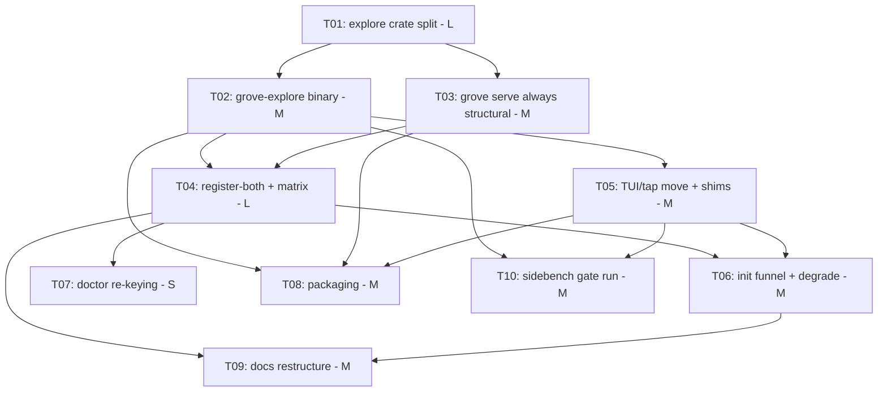

# Sprint Manifest — GROVE-S04: ADR 0004 stages 1–2 — split the explore delegate into grove-explore

**Sprint:** GROVE-S04
**Execution Mode:** wave-parallel
**Inputs:** [`SPRINT_REQUIREMENTS.md`](SPRINT_REQUIREMENTS.md), [ADR 0004](../../../docs/adr/0004-explore-split-into-grove-explore.md)

---

## Goals

1. `grove-cst` is a pure structural library again — zero LLM knowledge in its tree.
2. Two composable MCP surfaces replace the either/or: `grove serve` is always the
   7-tool structural server; `grove-explore` serves only the `explore` tool under
   its own identity; `init --as mcp-llm` registers both.
3. No inner-loop behavior change — proven by a full sidebench re-run matching the
   `base-q4-v2-hf` reference (80.6) on the split binary (gate test a) and the
   extended transition-matrix test (gate test b).
4. Release-ready: both binaries ride `release.yml`/npm/brew (no publish, D3), and
   all docs + steering tell the two-server story.

## Tasks

| Task ID | Title | Estimate | Depends On | Pipeline | Status |
|---|---|---|---|---|---|
| GROVE-S04-T01 | Stage 1 — move `core/src/explore/` into a new `explore/` workspace crate | L | — | default | draft |
| GROVE-S04-T02 | `grove-explore` binary — own MCP server identity, explore tool only, startup health gate | M | T01 | default | draft |
| GROVE-S04-T03 | `grove serve` always structural — delete `Surface`/`determine_surface`/serve mode flags/health fallback | M | T01 | default | draft |
| GROVE-S04-T04 | `mcp-llm` = register-both — `reconcile_harness` both-servers column, forward migration, extended transition-matrix (gate test b) | L | T02, T03 | default | draft |
| GROVE-S04-T05 | Move config/trace TUIs + `tap` to `grove-explore`; forwarding shims + string sweep | M | T02 | default | draft |
| GROVE-S04-T06 | `init --as mcp-llm` funnel — shell-out to `grove-explore config` + graceful PATH degrade | M | T04, T05 | default | draft |
| GROVE-S04-T07 | `doctor` re-keying — explore checks keyed on `grove-explore` registration, not mode | S | T04 | default | draft |
| GROVE-S04-T08 | Packaging — `release.yml`/npm/brew ship both binaries; release dry-run | M | T02, T03, T05 | default | draft |
| GROVE-S04-T09 | Docs restructure — two-server story (README, setup, mcp, steering templates, ADR annotations) | M | T04, T06 | default | draft |
| GROVE-S04-T10 | Gate test (a) — full sidebench re-run on the split binary (user-supervised rig) | M | T02, T05 | default | draft |

## Dependency Graph

**Waves** (tasks within a wave may run in parallel):

| Wave | Tasks |
|---|---|
| 1 | T01 |
| 2 | T02, T03 |
| 3 | T04, T05 |
| 4 | T06, T07, T08, T10 |
| 5 | T09 |

**Critical path:** T01 → T02 → T04 → T06 → T09 (crate split → new server →
harness semantics → init funnel → docs). T10 (sidebench) is user-gated and can
start as soon as wave 3 lands the final binary shape; it must complete before
sprint close.

## Sequencing rationale

- **T01 first and alone** — every other code task either consumes the new crate
  (T02, T05) or removes what it left behind (T03). The byte-identical-move AC
  is cheapest to verify when nothing else is in flight.
- **T02 ∥ T03** — independent halves of the surface split: one adds the new
  server, the other strips the old bimodality. Only T04 needs both.
- **T04 before T06/T07/T09** — the register-both semantics and migration are the
  contract that init's funnel, doctor's keying, and the docs all describe.
- **T08 after T05** — packaging ships the final verb surface (TUIs moved, shims
  in place); doing it earlier would package an intermediate binary.
- **T10 spans the tail** — the rig run is user-supervised (D1); scheduling it at
  wave 4 leaves wave-5 docs as the only work not blocking it, so a rig problem
  surfaces with maximal remaining calendar.

## Carry-over precondition

`GROVE-S03-T07` (`grove doctor`) is **approved but not committed**. It must be
committed before T07 (doctor re-keying) starts — T07 edits the same check
groups. Flagged in requirements carry-over; resolve at sprint start.

## Technical Debt

- Deprecation window debt taken on deliberately: `grove config`/`grove tap`
  forwarding shims and the removed `serve --explore/--standard` flags' error
  messages must be cleaned up **next** release (one-release window per ADR).
- `grove-explore` remains a guest writer of `.grove/config.json` until stage 3
  (accepted interim coupling; round-trip tested in T05).

## Risks

| Risk | Owning task | Mitigation |
|---|---|---|
| Sidebench rig unavailable/noisy at sprint close (gate a blocked) | T10 | Byte-identity diff lands in T01 review as the code-level backstop; rig run pinned to the reference combination; T10 scheduled at wave 4, not last |
| Existing single-registration `mcp-llm` projects break on upgrade | T04 | Forward migration on first `init`; extended transition-matrix test; doctor flags stale layout (T07) |
| Silent behavior drift during the crate move | T01 | Byte-identical move AC verified by diff in review; gate test (a) as end-to-end proof |
| 2-binary × 5-platform packaging breaks the pipeline | T08 | Release dry-run AC before sprint close; no actual publish (D3) |
| `init` shell-out fails on PATH-less installs | T06 | Graceful-degrade AC with dedicated test |
| Guest-writer config skew | T05 | Preserve read-modify-write semantics exactly; config round-trip tests |
